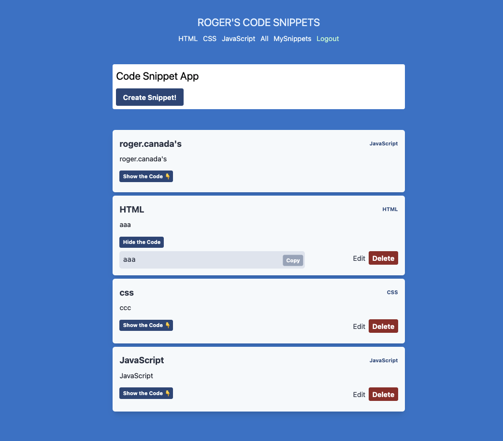

# Nextjs-Fuana-Auth0 Project - 1


### Stack
- Nextjs (First time)
- FaunaDB (First time using FQL)
- Auth0 (First time)
- SWR (First time)
- React Hook Form (First time)
- TailwindCSS (First time)
### Copy the `.env.local.example` file to `.env.local` and include your credentials.

- **FAUNA_SECRET**: your fauna token
- **AUTH0_SECRET**: A long secret value used to encrypt the session cookie. You can generate a suitable string using openssl rand -hex 32 on the command line
- **AUTH0_BASE_URL**: The base URL of your application.
- **AUTH0_ISSUER_BASE_URL**: The URL of your Auth0 tenant domain. If you are using a Custom Domain with Auth0, set this to the value of your Custom Domain instead of the value reflected in the "Settings" tab.
- **AUTH0_CLIENT_ID**: Your Auth0 application's Client ID.
- **AUTH0_CLIENT_SECRET**: Your Auth0 application's Client Secret.

### Run the development server:

```bash
npm run dev
# or
yarn dev
```

Open [http://localhost:3000](http://localhost:3000) with your browser to see the result.